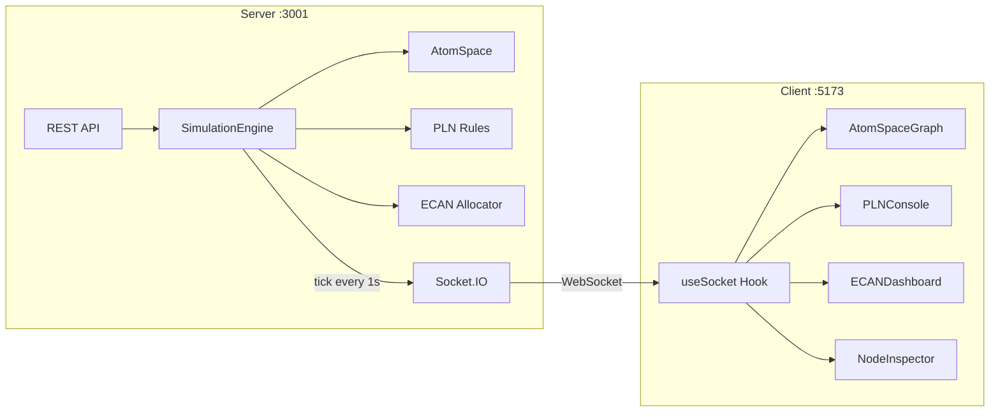

# OpenCog Cognitive Synergy Visualizer — Project Summary

## ✅ Status: All Systems Go

| Check | Result |
|-------|--------|
| Client build (`vite build`) | ✅ Passes clean |
| Server startup | ✅ Runs on `:3001` |
| Integration tests (9 tests) | ✅ All pass |
| Live dashboard render | ✅ All 3 subsystems live |
| WebSocket sync | ✅ Real-time data flowing |

---

## Architecture



## File Structure

```
opencog-viz/
├── server/
│   ├── src/
│   │   ├── index.js                  # Express + Socket.IO entry
│   │   ├── routes.js                 # REST endpoints
│   │   └── simulation/               # ← Separated engines
│   │       ├── engine.js             # Tick-loop orchestrator
│   │       ├── atomspace.js          # Hypergraph: 47 nodes, 42 links
│   │       ├── pln.js                # 4 rules: Deduction, Induction, Abduction, MP
│   │       └── ecan.js               # Rent/Wage/Spreading attention model
│   └── tests/integration/
│       └── sync.test.js              # 9 tests: REST + WebSocket sync
├── client/
│   ├── src/
│   │   ├── App.jsx                   # 3-column dashboard layout
│   │   ├── index.css                 # Glassmorphism + neon theme
│   │   ├── components/
│   │   │   ├── AtomSpaceGraph.jsx    # Force-graph with custom Canvas renderer
│   │   │   ├── PLNConsole.jsx        # Color-coded scrolling rule log
│   │   │   ├── ECANDashboard.jsx     # Sliders + stats + attention bar
│   │   │   └── NodeInspector.jsx     # Click-to-inspect node detail
│   │   └── hooks/useSocket.js        # Socket.IO state management
│   ├── tailwind.config.js            # Sci-fi design tokens
│   └── vite.config.js                # Dev proxy to backend
├── package.json                      # Root scripts (concurrently)
└── README.md
```

## Three Subsystems

### 🧠 AtomSpace Graph
- **47 ConceptNodes** with hierarchical + cross-domain links
- Node **size** ∝ STI (Short-Term Importance) — larger = more attended
- Node **color** = `hsl(strength × 160, ...)` — red (uncertain) → cyan (certain)
- Node **glow** ∝ attention intensity
- Click any node to inspect TV/AV and inject stimulus

### 🔗 PLN Console
- Deduction `⊢`, Induction `⊣`, Abduction `⇝`, Modus Ponens `→`
- Each rule fires 1–2× per tick, logged with premises + conclusion
- Color-coded by rule type with timestamp

### 💰 ECAN Dashboard
- **Rent Rate** — attention decay per tick
- **Wage Rate** — attention boost for inference participation
- **Spreading Rate** — how much attention propagates to neighbours
- **Focus Boundary** — STI threshold for "in focus"
- Attention distribution bar: Focused | Active | Forgotten
- Global stimulus + parameter reset buttons

## Quick Commands

```bash
# Start everything
cd opencog-viz && npm run dev

# Tests
npm test

# Individual servers
npm run dev:server   # Backend only
npm run dev:client   # Frontend only
```

## Recording


